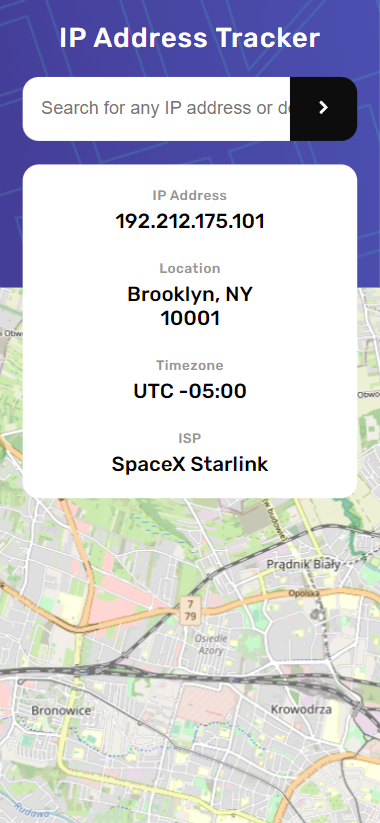

# Frontend Mentor - IP address tracker solution

This is a solution to the [IP address tracker challenge on Frontend Mentor](https://www.frontendmentor.io/challenges/ip-address-tracker-I8-0yYAH0). Frontend Mentor challenges help you improve your coding skills by building realistic projects.

## Table of contents

- [Overview](#overview)
  - [The challenge](#the-challenge)
  - [Screenshots](#screenshot)
  - [Links](#links)
- [My process](#my-process)
  - [Built with](#built-with)
  - [What I learned](#what-i-learned)
  - [Continued development](#continued-development)
  - [Useful resources](#useful-resources)
- [Author](#author)

## Overview

### The challenge

Users should be able to:

- View the optimal layout for each page depending on their device's screen size
- See hover states for all interactive elements on the page
- See their own IP address on the map on the initial page load
- Search for any IP addresses or domains and see the key information and location

### Screenshots

### Links

- Solution URL: [Add solution URL here](https://your-solution-url.com)
- Live Site URL: [https://kamilp522.github.io/ip-tracker](https://kamilp522.github.io/ip-tracker)

## My process

### Built with

- Semantic HTML5 markup
- Flexbox
- Mobile-first workflow
- [Sass](https://sass-lang.com/) - CSS preprocessor
- [leaflet](https://leafletjs.com/) - Leaflet opensource map
- [Ipify](https://geo.ipify.org/) - Geo ipify - IP geolocation API

### What I learned

Well, I learned that i can't hide my API key when I process it on the client-side code.

### Continued development

I'll probably try to use some framework in the future or learn more about backend development.

### Useful resources

- [Fetch Introduction](https://www.youtube.com/watch?v=Oive66jrwBs&ab_channel=TraversyMedia) - Video by TraversyMedia, helped me understand how to use fetch api in my work

- [How to build api](https://youtu.be/khM21aJ8uOE) - This video by Ania Kubów provided me a great example on how to approach building an api app. Great source.

## Author

- Frontend Mentor - [@kamilp522](https://www.frontendmentor.io/profile/kamilp522)
